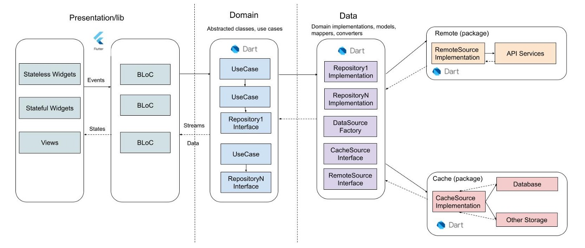
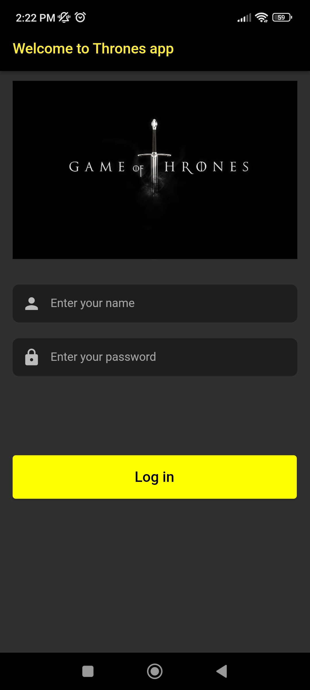
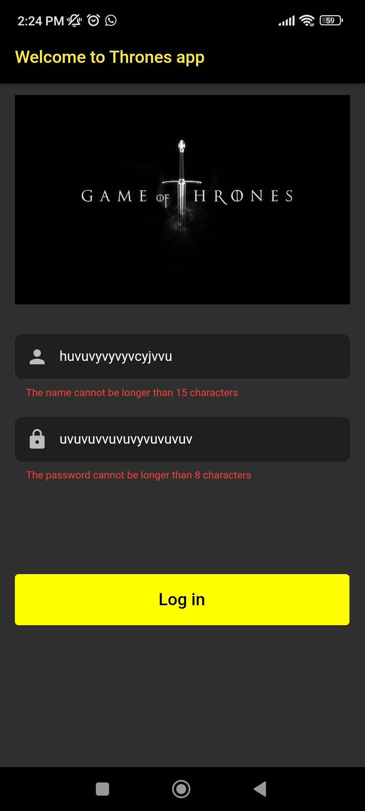

# Game of Thrones App

This app was created using the Game of Thrones Character API https://thronesapi.com/.
The chosen API was this because it's simple since it give us all the data required with
just one endpoint.

## Characteristics

- Architecture: I decided to use an architecture despite the assessment could not required one,
because in my opinion doing it on this way you can ensure that you project would be scalable and testable.
The architecture chosen was CLEAN ARCHITECTURE due it divide our project in different layers. These
layers are called DATA, DOMAIN, PRESENTATION. In each one of them there are sublayers DATA[datasources, models, repositories], DOMAIN[usecases, entities, repositories], PRESENTATION[state management, widgets]. All this structure and sections are shown in the image below:

- State Management: The state management used was BLoC (Business Logic Component) because it is too friendly with
the chosen architecture as well as it helps us separate the logic from UI. In the project I created two blocs:

     AuthenticationBloc: This bloc contains all the logic about the user's session, for example, this bloc simulate an API login using your name and password.

     CharactersBloc: This bloc was created to get all the characters from API and handle the list state changes.

- Error Handler: It was used the third part library called Either which use functional programming, it allow us to
work with error objects instead working with exceptions.

- Authentication with local persistency: I used local persistency through shared preferences to simulate a
real authentication. First of all we need to create a boolean flag to handle the simulation,

- Dependency Injection: GetIt was used because it is a comfortable, easy to use and scalable, this third part library allows create singletons and factories in a organized way.

## Getting Started

    Clone the repository and run the app.

## App use instructions

    When the app starts the first thing that it does is verify the user state, if the user is authenticated already the screen shown will be the characters list, otherwise the login screen will be displayed.

    For the login screen there are two inputs with basic validations along a login button which validate the inputs.

<table>
  <tr>
    <td></td>
    <td></td>
  </tr>
</table>

when you press the login button it calls
the event "Login" which call the function from the repository to save the boolean flag in true and then the
state is changed to authenticated.

